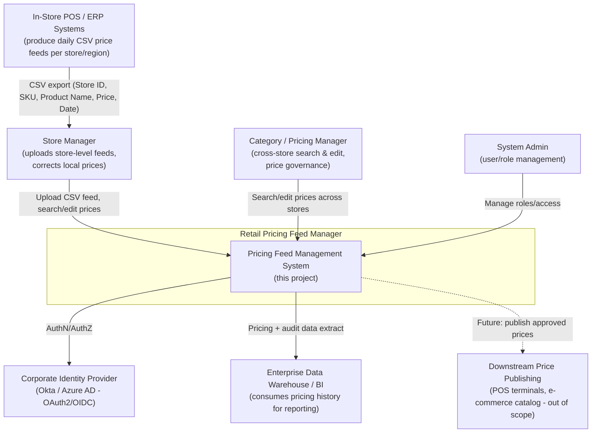
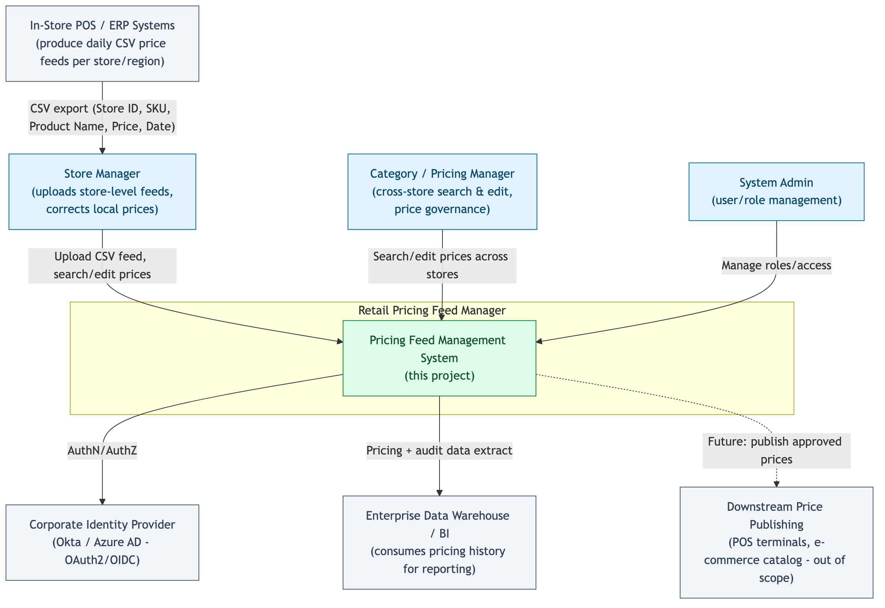
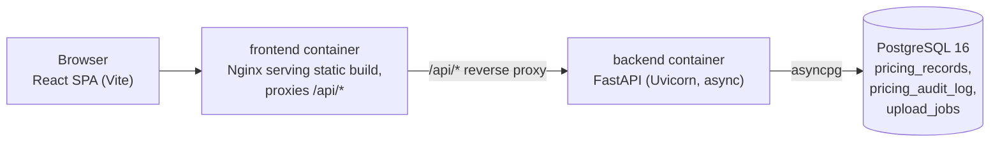
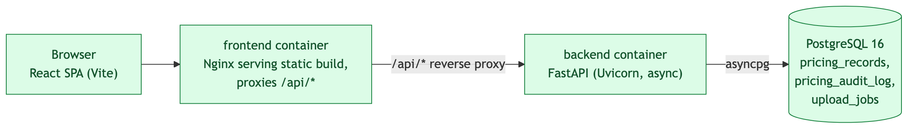
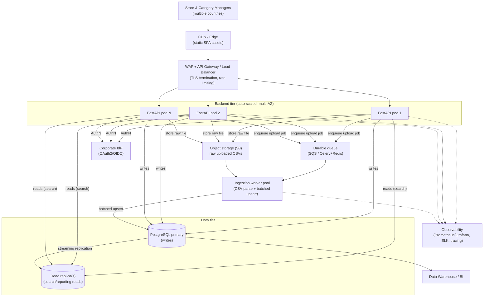
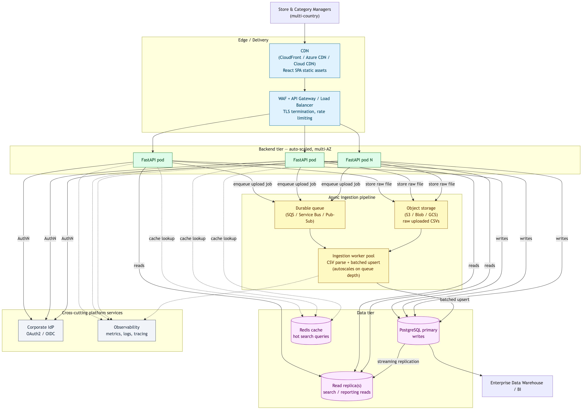
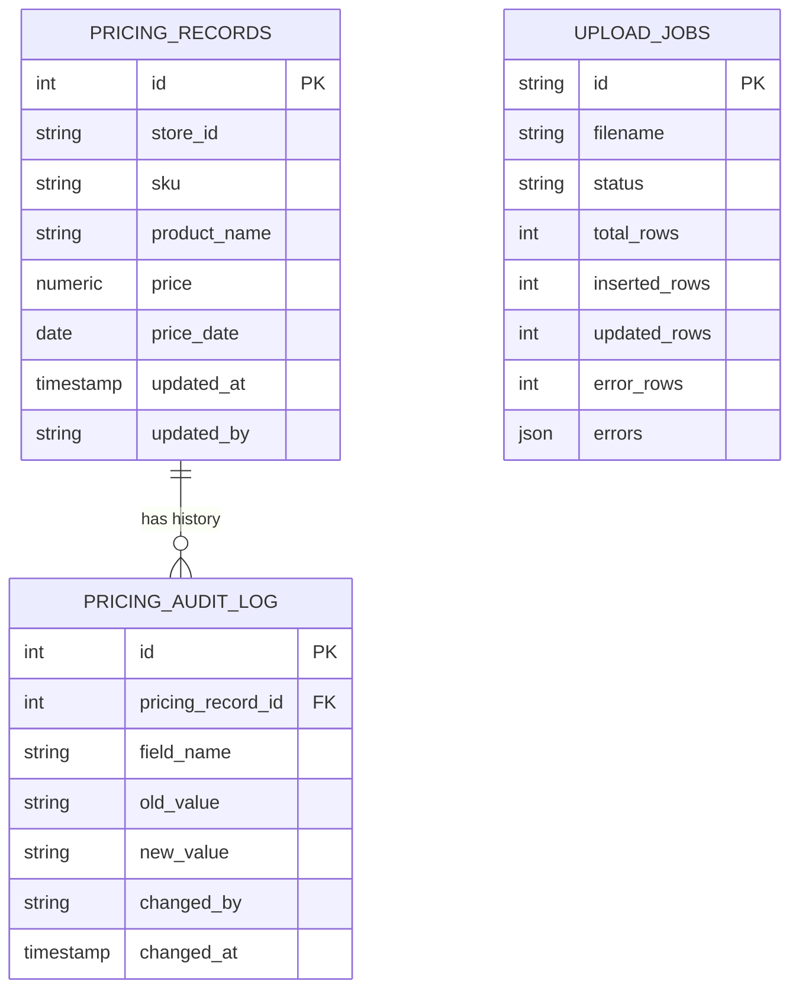

# Retail Pricing Feed Manager — Architecture & Design

Deliverables covered in this document: Context Diagram, Solution Architecture, Design
Decisions, Non-Functional Requirements, Assumptions, and a pointer to the implementation source.

---

## 1. Context Diagram

Actors and external systems around the Pricing Feed Management System, for a chain of ~3,000
stores operating across multiple countries.

**Notes:** the system is the authoritative back-office tool for capturing and correcting pricing
data; publishing approved prices back out to POS/e-commerce is treated as a separate downstream
integration (see Assumptions).

---

## 2. Solution Architecture

### 2.1 Reference implementation (what is built in this repo / `docker-compose.yml`)

The backend is a single stateless FastAPI process; CSV ingestion runs as an in-process
`BackgroundTask` after returning `202 Accepted` with a job id that the SPA polls.

### 2.2 Target production topology (how this scales to 3,000 stores / multi-country)

The only structural change going from the reference implementation to this target is swapping
`BackgroundTasks` for a durable queue + separately scaled worker pool, and adding a read replica
for search traffic — the API and data-model contracts stay identical, so the migration is additive
rather than a rewrite.

### 2.3 Component responsibilities

| Layer | Responsibility | Key files |
|---|---|---|
| Presentation | Upload UI, filterable/sortable results table, inline edit | `frontend/src/components/*`, `frontend/src/App.jsx` |
| API | Request validation, auth, pagination, OpenAPI docs | `backend/app/routers/*`, `backend/app/schemas.py` |
| Service | CSV parsing/validation, batched idempotent upsert, job tracking | `backend/app/services/csv_ingest.py` |
| Data | System-of-record schema, constraints, audit trail | `backend/app/models.py` |
| Cross-cutting | AuthN dependency, config/env | `backend/app/auth.py`, `backend/app/config.py` |

### 2.4 Data model

`(store_id, sku, price_date)` is a unique constraint — it is both the natural key from the CSV
feed and the conflict target for idempotent upserts (re-uploading the same feed, or retrying a
failed job, never creates duplicates).

### 2.5 API surface

| Method | Path | Purpose |
|---|---|---|
| `POST` | `/api/uploads` | Accept a CSV file, return `202` + job id immediately |
| `GET` | `/api/uploads/{job_id}` | Poll ingestion progress/result |
| `GET` | `/api/pricing` | Search with filters (`store_id`, `sku`, `product_name`, price range, date range) + pagination |
| `GET` | `/api/pricing/{id}` | Fetch one record |
| `PATCH` | `/api/pricing/{id}` | Edit `product_name`/`price`; writes an audit log entry per changed field |
| `GET` | `/api/pricing/{id}/history` | Field-level change history for a record |

Full interactive schema is auto-generated by FastAPI at `/docs` (Swagger) and `/redoc`.

---

## 3. Design Decisions

- **FastAPI + async SQLAlchemy over sync Django/Flask.** The workload is I/O-bound (DB round
  trips, file streaming); async lets a small number of worker processes hold many concurrent
  upload/search requests without a thread per request, which matters once hundreds of stores
  can be uploading feeds around the same time window.

- **PostgreSQL over NoSQL.** Pricing data is inherently relational (store × SKU × date), needs
  strong consistency for financial-adjacent data, and benefits from native `UNIQUE` constraints
  to make ingestion idempotent and `JSONB`/GIN indexing where flexibility is still needed (e.g.
  `upload_jobs.errors`). A document store would need to reimplement these guarantees in
  application code.

- **Upsert-on-ingest, append-only audit log for manual edits.** A CSV feed re-upload represents
  "this is the current price," so it upserts in place; a human edit via the UI is a discrete,
  attributable event worth preserving forever for dispute resolution and compliance, so it is
  additionally logged to `pricing_audit_log` with old/new value and actor. Two different update
  semantics for two different real-world events, rather than one generic "history table"
  that would blur feed replays with deliberate corrections.

- **Async job pattern for uploads (`202` + poll), not a synchronous request.** A feed covering
  many stores/SKUs can be large; holding an HTTP connection open for the full parse+upsert risks
  gateway timeouts and ties up a worker. The reference implementation uses FastAPI
  `BackgroundTasks` to keep the codebase dependency-light; the documented production upgrade
  (§2.2) swaps this for a durable queue without changing the client-facing contract.

- **Batched upsert (`CSV_BATCH_SIZE=2000`) instead of row-by-row or single giant transaction.**
  Row-by-row is too slow at scale; one transaction for the whole file risks long lock hold times
  and makes partial-failure recovery harder. Batching bounds memory and lock duration while still
  reporting progress incrementally via `upload_jobs.processed_rows`.

- **Partial success on CSV validation.** Bad rows (bad price format, unparseable date, missing
  fields) are skipped and reported with line numbers; the rest of the file still loads. Real
  multi-country, multi-store feeds have data-quality issues, and rejecting an entire 50,000-row
  file over one bad row is worse for the business than surfacing the 3 rows that need a fix.

- **Single Page Application with a thin REST API.** Matches the stated requirement, keeps the
  client framework-agnostic to swap later, and reuses the same auth/authorization model as the
  API (no separate server-rendered session state to secure).

- **API-key header in the reference app, designed to be replaced by OAuth2/OIDC.** A real
  3,000-store, multi-country deployment needs SSO integration with the corporate IdP and
  role-based scoping (e.g., a store manager restricted to their own `store_id`). The auth
  dependency (`backend/app/auth.py`) is isolated behind one function specifically so this swap
  doesn't touch route handlers.

- **Currency/locale intentionally deferred, not designed away.** The specified CSV schema
  (Store ID, SKU, Product Name, Price, Date) has no currency column. Rather than guessing a
  multi-currency model not asked for, the schema keeps `price` as `NUMERIC(12,2)` and treats
  currency as a property resolvable from a future `stores` master table by `store_id` — an
  additive change, not a breaking one.

---

## 4. Non-Functional Requirements

Baseline assumption: a chain of ~3,000 stores across multiple countries implies high write
concurrency during feed windows, large cumulative data volume, multi-region users, and
compliance/audit expectations typical of retail pricing.

| NFR | Target | How the design addresses it |
|---|---|---|
| **Scalability** | Support concurrent feed uploads from up to 3,000 stores and tens of millions of price rows/year | Stateless FastAPI instances scale horizontally behind a load balancer; streaming CSV parser (constant memory regardless of file size); batched upserts; production topology adds a queue + worker pool so ingestion scales independently of API traffic; `pricing_records` can be range-partitioned by `price_date` as volume grows |
| **Performance** | Search P95 < ~500ms at scale | Indexes on `store_id`, `sku`, `price_date`; pagination (default 25, max 200 rows/page); read replica for search traffic in production topology; `ILIKE` product-name search is a documented candidate for a `pg_trgm` index once volumes require it |
| **Availability** | 99.9%+ | No server-side session state → any instance serves any request; `/health` endpoint for load-balancer checks; multi-AZ Postgres with replica failover in production; rolling deploys |
| **Data integrity / idempotency** | Re-uploading a feed or retrying a failed job must never duplicate data | `UNIQUE(store_id, sku, price_date)` constraint + `ON CONFLICT DO UPDATE` upsert |
| **Auditability & compliance** | Every manual price change must be attributable and reversible-in-spirit | `pricing_audit_log` records field, old/new value, actor, and timestamp per edit; `upload_jobs` retains feed ingestion provenance and error detail |
| **Security** | Protect pricing data and prevent unauthorized changes | All endpoints require authentication; Pydantic validates all input; SQLAlchemy parameterizes all queries (no SQL injection surface); CORS restricted to known origins; production plan: TLS everywhere, OAuth2/OIDC with role-based scoping, secrets via a vault/parameter store, WAF at the edge |
| **Internationalization** | Multi-country store feeds | Date parser accepts multiple common formats (`YYYY-MM-DD`, `MM/DD/YYYY`, `DD/MM/YYYY`); currency/locale-aware formatting is flagged as a roadmap item (see Assumptions) rather than silently mishandled |
| **Observability** | Diagnose ingestion failures and latency issues in production | Structured logging in the reference app; production plan adds per-request correlation IDs, metrics (upload throughput, error rate, search latency) exported to Prometheus/Grafana, and centralized log aggregation |
| **Disaster recovery** | Bounded data loss/downtime on failure | Managed Postgres with automated backups + point-in-time recovery (assumed RPO ≈15 min, RTO ≈1 hr on a managed service); infrastructure defined as code/containers so environments are reproducible |
| **Portability / deployability** | Deployable on-prem or in any major cloud | Fully containerized (Docker); `docker-compose.yml` for local/dev parity; production target is Kubernetes, but no code depends on a specific cloud provider's proprietary API |
| **Maintainability** | Multiple teams can extend the system safely | Layered structure (routers/services/models), typed Pydantic schemas, auto-generated OpenAPI docs, automated test suite (`pytest`) covering ingestion, search, and edit/audit behavior |

---

## 5. Assumptions

- The CSV schema is fixed to the five specified columns (Store ID, SKU, Product Name, Price,
  Date); no currency, tax, or promotional-price columns are present in v1 feeds.
- A price is uniquely identified by `(store_id, sku, price_date)` — one price per store/SKU/day.
  Multiple price changes for the same SKU/store on the same calendar day are out of scope.
- Re-uploading a feed represents "this is now the current price for these rows," so ingestion
  upserts rather than creating a new time-series row per upload; deliberate manual corrections
  are what the audit log is for.
- `store_id` and `sku` are pre-existing, well-formed identifiers issued by upstream store/product
  master systems. This reference implementation does not validate them against a stores/products
  master table (no such table was in scope), but the schema allows adding that foreign-key
  relationship later without breaking the pricing table's shape.
- Users are internal staff (store managers, category/pricing managers, admins), not end
  customers; authentication integrates with an existing corporate identity provider rather than
  implementing bespoke user/password management.
- This system is the authoritative back-office tool for capturing and correcting pricing data.
  Publishing approved prices out to POS terminals or e-commerce catalogs is a separate downstream
  integration, not built here.
- Individual upload files are bounded (configurable, default 200MB) and may cover any subset of
  stores/SKUs — a single file is not assumed to contain the entire chain's catalog at once.
- "Price" is a catalog/list price for editorial management, not a transactional/financial ledger
  entry, so no double-entry accounting or payment-grade controls are implied.
- No offline mode is required for the SPA; users are assumed to have network connectivity to the
  corporate application tier.

---

## 6. Source for the Implementation

The full source is in this repository:

- **Backend** — [backend/app](../backend/app): FastAPI app, SQLAlchemy models, Pydantic schemas,
  CSV ingestion service, routers, auth dependency. Tests in [backend/tests](../backend/tests)
  (`pytest`, 8 passing cases covering upload/upsert, validation errors, search, and edit+audit).
- **Frontend** — [frontend/src](../frontend/src): React SPA (Vite) — `UploadPanel`,
  `SearchFilters`, `PricingTable` components and a thin `api/client.js` fetch wrapper.
- **Infrastructure** — [docker-compose.yml](../docker-compose.yml),
  [backend/Dockerfile](../backend/Dockerfile), [frontend/Dockerfile](../frontend/Dockerfile) +
  [frontend/nginx.conf](../frontend/nginx.conf).
- **Sample data** — [sample_data/sample_pricing_feed.csv](../sample_data/sample_pricing_feed.csv).
- **Run instructions** — [README.md](../README.md).
